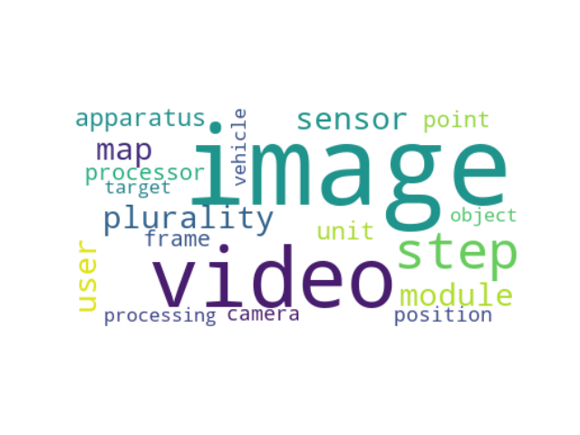

# PatentData_TopicModelling
Analyzing composition and latent topics of USPTO patent data

## Project Overview

This project is a Capstone Project of **Udacity's** Nanodegree in Data Science. Most of the coding is done via Python, while the frontend of the dashboard has been build via the Bootstrap framework in HTML, JavaScript and CSS.  The project contains a model which can discover the latent, hidden topics in digitalized patent data via a Latent Direchlet Allocation Algorithm and can classify patent data to these latent topics. Additionally, a detailed documentation, an html and flask based dashboard as well as the employed test data set are included as well. The topic model has extracted the latent topics for each CPC patent section and can classify new patents accordingly. The trained model can be further applied to the text of other patents. The latent topics are visualized via wordcloud in the dashboard.

CPC - Cooperative Patent Classification:
* A: Human Necessities
* B: Operations and Transport
* C: Chemistry and Metallurgy
* D: Textiles
* E: Fixed Constructions
* F: Mechanical Engineering
* G: Physics
* H: Electricity
* Y: Emerging Cross-Sectional Technologies

### The Dataset

The dataset is open acess and has been originally downloaded from the 'United States Patents and Trading Office' (USPTO) at the 2020-07-07: 
https://developer.uspto.gov/data?search_api_fulltext=&sort_by=field_version_and_date&page=0
It features a zip archive and in it contained a single html file which further contains a selection of different patents in their own html files. The dataset is also stored in this respository.
The file introduction.ipynb features a CRISP-DM approach and contains further information on patents, the data as well as the algorithm which converts the patent data into a more managable dataframe and csv file.

### Python Libraries required for hosting the app

* Data Wrangling and Processing: **pandas, numpy, json, joblib, xml, bs4**
* Natural Language Processing: **re, nltk**
* Model Building: **Scikit-Learn**
* Data Visualisation: **matplotlib, Plotly, wordcloud**
* Web Deployment: **Flask**

### Further information on the web development

* Front-end: The web pages were generated with **BootstrapCDN**
* Back-end: **Flask** was employed to generate the back-end code

### Structure of the project

<pre>
- "app" folder
| - runWebApp.py            				#flask script which hosts the backend of the dashboard
| | - folder "example_images_app"			# features example image from the dashboard for the readme
| |- "static folder"
| | - various png							# various example word cloud representations
| |- "templates folder"
| | - master.html  							# main page of web app
- "data" folder
| - "datasets" folder  						# contains the dataset
| |- ipa200709.zip  						# dataset
- "model" folder
| - alltopWords.pkl							# pickle file contains all words and topics for visualization as word clouds via 'visualize_LDA_model_wordcloud.py '
| - lda_model_A.pkl							# the lda models for section A till
| - ...............
| - lda_model_H.pkl							# section H
| - train_LDA_model.py						# python script which loads the csv dataset, tokenizes it and trains a LDA model for each patent section. Saves models and top words for further visualization and classifies the patents to the newly discovered latent, hidden topics
- "wordClouds" folder
| - visualize_LDA_model_wordcloud.py  		# The python script which visualizes the top words of each topic
| - 80 png files							# representing word clouds for the 8 patent sections and 10 topics per patent section

-introduction.ipynb   # Jupyter notebook containing CRISP-DM approach & the xml to csv converter of the data
-LICENSE     # license information
-README.md   # the readme
</pre>

### Instructions for locally hosting the app:

1. Run the following commands in your local project directory to set up your datset and model.

    - To run jupyter notebook which converts the dataset to a csv file
        `python -i introduction.ipynb`
    - To train the lda model for each patent section and classify the csv dataset to the latent topics
        `python model/train_LDA_model.py`

2. Run the following command in the app's directory to run your web app.
    `python runWebApp.py`

3. Go to http://127.0.0.1:5000/

### Eample Screenshots of the App

_The dashboard of the project features a navbar with different useful links as well as detailed and interative plotly visualizations._

_Exmparily word cloud of the latent topic 3 of the patent section A. The topic is related to chemcial compounds._

_Exmparily word cloud of the latent topic 0 of the patent section C. The topic is related to microbiology._

_Exmparily word cloud of the latent topic 1 of the patent section G. The topic is related to processing digital signals and image detection._

_Exmparily word cloud of the latent topic 5 of the patent section G. The topic is related to sensor technology and measurements._

### Information on the model

The topic model is based on Scikit-Learns implementation of the latent Direchlet Allocation algorithm. 
For each of the patent section a model is trained and optimized via the Gridsearch functionality.
Tokenization of the patent text data is carried out via the libraries nltk and regular expresions.

### Project Conclussion

The LDA model is able to predict different latent topics for each of the sections and can sucessfully classify the patents in the data set accordingly.
This classifcation seems to be working well, since the word clouds and the patents with the corresponding topic classifcation match well. 
However, it is not trivial to differentiate between the different latent topics based on the word cloud representation alone, as some of the topics do not seem distinct enough to a human reader. This is likely related to the data. The test data provided provided by USPTO does not equally feature all possible cpc patent sections and thus the quality of each LDA model can vary. A bigger data set might be able to generate a more reliable model and this might be the next step in further improvement.

### Project Outlook
Since analysis and understanding of patent data is an extremely relevant topic, there is a huge amount of information avaible.  During the development of this captstone project, this quickly exceeded the original scope of the project. The following possibilities have been compiled to further build on the current state of this project work. Most of these are planed for a future release:

* Employing the full bulk data set from USPTO or alternatively connect the project to an EPO compatible API
* Building an SQL based database and ETL parser for the HTML data 
* Further optimization of the Scitkit-learn-based model and additiony testing other algorithms like Latent semantic analysis (LSA) and Non-Negative Matrix Factorization (NMF)
* Switch from Scikit-learn to the Gensim library - an extremely well optimized python library which builds on Scikit-learn and is speciallized for topic modeling
* Employing  aKL divergence based evaluation of the natural number of topics to optimize the number of topics  [1]
* Applying a more sophisticated visualization than wordclouds - for example via the library pLADvis
* Differntiation between patent continuiation applications and consideration of patent run time
* Analysis of companies in terms of patent portfolio and patent run time with the aim to predict future trends 

### Aknowledgement

* The United States Patent and Trading Office for collecting, hosting and providing the patent data
* A multitude of Stackoverflow users whose questions and answers I found, when looking for a specific coding problem.
* [1] Suominen, A., & Toivanen, H. (2015). Map of technology: _Topic modelling full-text patent data._ Paper presented at 5th Global TechMining Conference, GTM 2015, Atlanta, United States.:   https://cris.vtt.fi/en/publications/map-of-technology-topic-modelling-full-text-patent-data

### Further Reading

Topic Modeling:

* https://nlpforhackers.io/topic-modeling/
* https://stackabuse.com/python-for-nlp-topic-modeling/
* https://towardsdatascience.com/evaluate-topic-model-in-python-latent-dirichlet-allocation-lda-7d57484bb5d0
* https://www.machinelearningplus.com/nlp/topic-modeling-python-sklearn-examples/#9buildldamodelwithsklearn

Patentinformationen:

* https://www.uspto.gov/web/patents/classification/cpc
* https://www.dpma.de/english/patents/patent_protection/index.html

